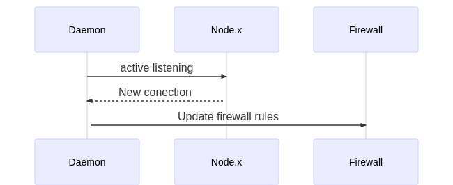

# ipt-onchain

## Introduction

## How ipt-onchain works

ipt-onchain is a particular implementation that allows a user secure its connections to a server by using smart contracts as a source of trust.

In this implementation a daemon listens to an ethereum smart contract which tells the node to whom to establish a secure connection.

Basically two diagrams shows how it works:

* An admin adds/remove a new participant in the newtowrk by adding this to a permissioning smart contract: 

* The daemon realizes a new connection has been added/removed in the smart contracct and updates its *firewall rule*: 

## Requisites

* [golang](https://www.digitalocean.com/community/tutorials/how-to-install-go-on-ubuntu-18-04) 1.13 or higher [versions](https://golang.org/dl/)

* Your node should expose RPC in HTTP and WS protocols.

* You need to allow access to the ethereum node to connect in the HTTP-RPC and WS-RPC ports (in this implemetation the ethereum node is hosted on the same machine where the daemon is running): 

## How to use

### Deploy the onchain permissioning contracts

* To interact with this project you should should have deployed the smart contract to that allows you dinamically set which participants are allowed to connect.
There are some permissioning smart contracts implementations out there.

Particularly this project uses the [Pegasys implementation](https://github.com/PegaSysEng/permissioning-smart-contracts). Please follow the [instructions](https://github.com/PegaSysEng/permissioning-smart-contracts) in order to deploy the smart contract in a set of nodes.

### Clone the repository

* mkdir -p ~/ipt-project/src

* export GOPATH=~/ipt-project

* cd ~/ipt-project/src && git clone https://github.com/eum602/ipt-onchain.git && cd ipt-onchain

### Compile process (optional)

* docker is required

* Compiling contracts

```shell
cd pkg/onchain
chmod +x *.sh && ./main.sh
cd ../..
```

### Building process

```shell
go get ./... && go build -o main
```

### Preparing  environment variables

* Edit the environment variables on the file env.sh

```shell
vi ~/ipt-project/ipt-onchain/env.sh
export RPC_HTTP_URL=http://127.0.0.1:4545 #the RPC HTTP exposed port in your ethereum node.
export RPC_WS_URL=ws://127.0.0.1:4546 #the RPC WS exposed port in your ethereum node.
export NODE_INGRESS_CONTRACT_ADDRESS=0x0000000000000000000000000000000000009999 # please replace this address by the address corresponding to your permissioning smart contract deployment.
export ADD_DEFAULT_SECURITY_RULES=false #If set to true a new chain is added to the 'filter' table in the 'INPUT' chain
```

### Running code

```shell
chmod +x env.sh
source env.sh
go run *.go
```
